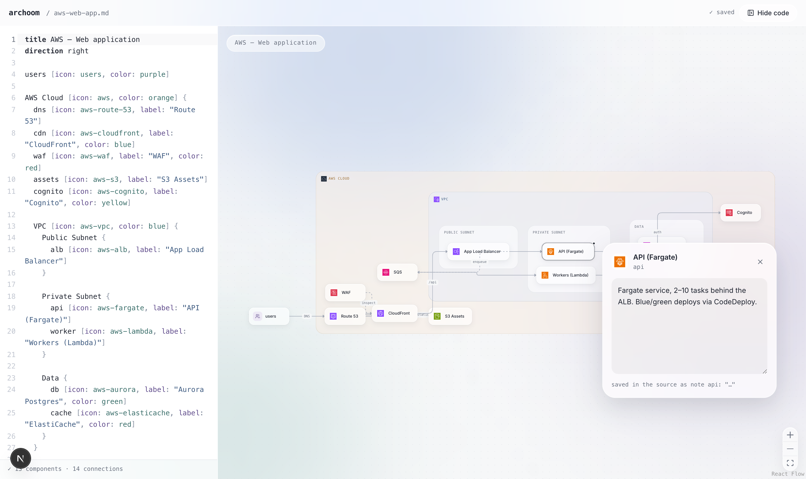

# archoom

**Architecture diagrams as code — beautiful, interactive, and stored in plain files.**



archoom renders architecture diagrams from a small text DSL onto an interactive canvas. Each diagram is a plain `.md` or `.yaml` file in your repo: edit it in your editor or in the built-in code panel, click any component to attach a note, and — when you run it locally — everything is written straight back to the file. No database, no accounts: diagrams live with your code and review like code. Deploy it as a read-only gallery and share any diagram as an interactive, embeddable link.

## Features

- **Files are the source of truth.** Diagrams are `.md` / `.yaml` files in `diagrams/`. Edits and notes are debounce-saved back into the file itself (locally).
- **Diagram-as-code DSL.** Nodes, nested groups, labeled connections, colors and icons in a few lines of text.
- **Two modes.** An editor (`/e/<slug>`) with a live code panel, and a read-only, embeddable viewer (`/v/<slug>`).
- **Automatic layout.** ELK's layered algorithm handles nested containers; pan, zoom and drag freely on a React Flow canvas.
- **Click-to-annotate.** Select a component and write a note in the panel that opens next to it. Notes are stored as `note` statements in the source, so they travel with the file and show up in diffs.
- **Official cloud icons.** 1,150+ vendored AWS / Azure / GCP architecture icons, plus a general-purpose line-icon set with fuzzy name matching.
- **Shareable & embeddable.** Drop any diagram into another site with a single `<iframe>` — no database, no secrets, no accounts.

## Getting started

```bash
pnpm install
pnpm dev
```

Open <http://localhost:3000>. The index lists every diagram found in `diagrams/`; click one to open it in edit mode (`/e/<slug>`). Add a new diagram by dropping a `.md` or `.yaml` file into `diagrams/`.

## Two modes: edit & view

Every diagram is reachable two ways:

| Route | Mode | What you get |
| --- | --- | --- |
| `/e/<slug>` | **Edit** | Full workbench — code panel, live re-render, click-to-annotate. Saves back to the file when the filesystem is writable (i.e. running locally). |
| `/v/<slug>` | **View** | Chromeless, interactive, read-only viewer — pan, zoom, hover-to-focus, read notes. Built to embed. |

On a read-only host (like Vercel) the editor still works as a **live playground**: you can tweak the DSL and watch the diagram update, it just doesn't persist. To change a deployed diagram, edit the file locally and push — the source files are the single source of truth.

## Sharing & embedding

Open any diagram and hit **Share** to copy its `/v/<slug>` link or a ready-made `<iframe>` snippet. The `/v/*` routes send `Content-Security-Policy: frame-ancestors *`, so the viewer drops into an `<iframe>` on any site:

```html
<iframe src="https://your-app.vercel.app/v/my-system" width="100%" height="480" style="border:0;border-radius:16px" loading="lazy"></iframe>
```

## Deploying

archoom is a standard Next.js app — deploy it anywhere that runs Next, Vercel being the obvious choice:

[](https://vercel.com/new/clone?repository-url=https://github.com/cuisangelo/archoom)

```bash
vercel --prod
```

Because the deployed filesystem is read-only, the live site serves diagrams in view / playground mode for everyone — nobody can overwrite your diagrams. You author locally and push; Vercel redeploys from the repo.

### Configuration

There is one optional environment variable — no database, no secrets, no accounts:

| Variable | Default | Effect |
| --- | --- | --- |
| `ARCHOOM_EDIT` | unset | `1` forces saving **on** (writable self-host); `0` forces it **off** (preview the read-only deploy locally). Unset = on when local, off on Vercel. |

## Diagram files

**Markdown** — the first fenced code block is the diagram source; frontmatter feeds the index page. Prose around the block is yours to keep:

````markdown
---
title: My system
description: Shown on the index page.
---

```archoom
title My system
direction right

users [icon: users]
api [icon: server, label: "API", color: blue]
db [icon: postgres, label: "Postgres", color: green]

users > api: HTTPS
api > db: SQL
```
````

**YAML** — the DSL goes under a `source:` block scalar:

```yaml
title: My system
description: Shown on the index page.
source: |
  users [icon: users]
  api [icon: server]
  users > api
```

## DSL reference

### Nodes

```
name [icon: server, label: "Display name", color: blue]
"Name with spaces" [icon: database]
```

All properties are optional. Undeclared names used in connections are created automatically.

### Groups

Groups nest arbitrarily and accept the same properties as nodes:

```
Cloud [icon: aws, color: orange] {
  VPC [icon: aws-vpc, color: blue] {
    api [icon: server]
    db [icon: postgres]
  }
}
```

### Connections

| Syntax | Meaning |
| --- | --- |
| `a > b` | arrow |
| `a < b` | reverse arrow |
| `a <> b` | bidirectional |
| `a - b` | plain line |
| `a -- b` | dotted line |
| `a --> b` | dotted arrow |

Connections take labels, fan out and chain:

```
api > db: read/write
api > db, cache
users > web > api > db
```

### Directives

```
title My architecture
direction right   // right (default), left, down, up
```

### Notes

```
note api: "Stateless — scales horizontally behind the load balancer."
```

Created and updated automatically when you annotate from the UI; safe to write by hand too.

### Colors

`gray`, `blue`, `green`, `red`, `orange`, `yellow`, `purple`, `pink`, `teal`, or any `#rrggbb` hex.

## Icons

- **General:** line-icon names like `server`, `database`, `queue`, `cache`, `users`, `browser`, `lock`, `monitoring`… Unknown names fall back to the closest glyph by fuzzy matching.
- **Cloud:** official provider icons with `aws-*`, `azure-*`, `gcp-*` slugs — e.g. `aws-lambda`, `aws-fargate`, `azure-kubernetes-services`, `gcp-bigquery` — plus shorthands such as `aws-s3`, `aws-sqs`, `aws-alb`, `aws-vpc`, `azure-aks`, `gcp-gke`.
- **Refreshing the packs:** `node scripts/import-cloud-icons.mjs` downloads the providers' current icon packages and regenerates `public/icons/` and the manifest. Update the URLs in the script when a new quarterly package ships.

Cloud provider icons remain under their respective owners' terms — see [public/icons/README.md](public/icons/README.md).

## Contributing

Issues and pull requests are welcome. The diagrams under `diagrams/` are examples — drop in your own `.md` / `.yaml`, run `pnpm dev`, and the source files are the only state you need to reason about. Keep changes small and the DSL boring.

## Stack

[Next.js](https://nextjs.org) · [React Flow](https://reactflow.dev) · [elkjs](https://github.com/kieler/elkjs) · [CodeMirror 6](https://codemirror.net) · [Tailwind CSS 4](https://tailwindcss.com) · [Lucide](https://lucide.dev)

## License

[MIT](LICENSE)
